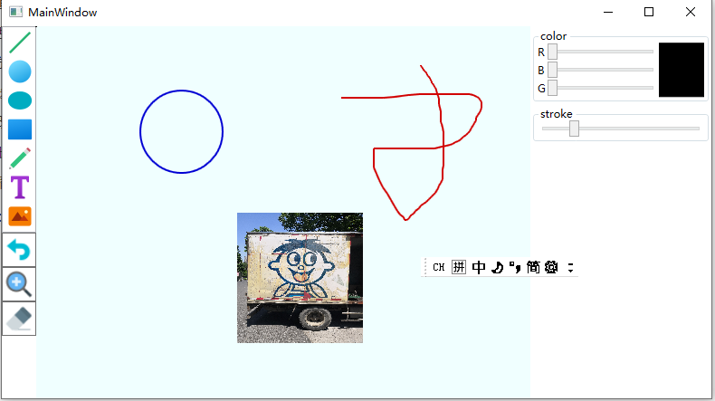

# J8-Painter: A Windows desktop painter application made with WPF and C#

## Features：

- Draw basic geometries, including lines, rectangles, circles and ellipses
- Draw random lines
- Draw texts on the screen
- Draw images from local storage
- Select multiple elements
- Drag and move, delete selected elements
- Edit properties of selected elements
- Multiple undos of operations

## Exmaple:

